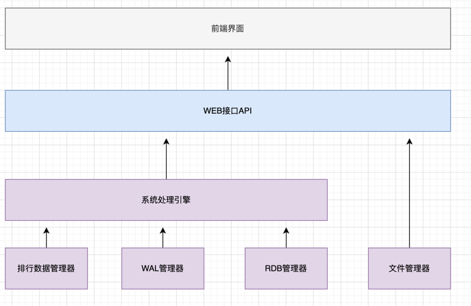
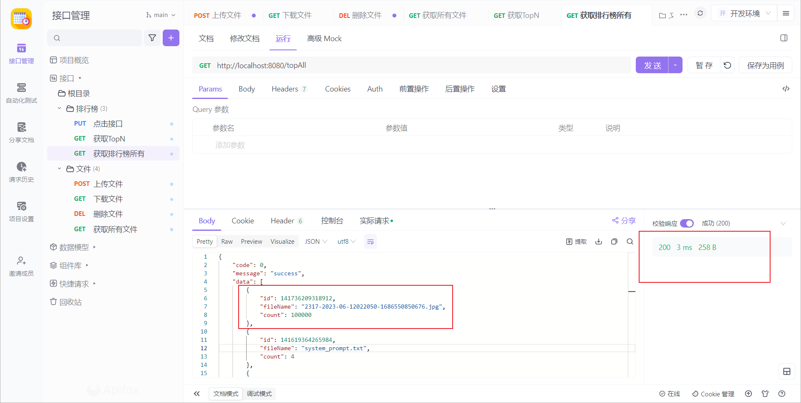

# 文件点击系统
## 系统介绍
本系统是**不采用任何外部库**来实现数据可靠不丢失、性能好、响应实时的文件点击系统

后端语言采用go语言，前端采用html
### 系统架构


### 系统流程
> 文件需要先上传生成id，根据id进行点击事件


## 设计方案
### 设计思路
#### 总体设计

不使用外部库，数据不丢=>磁盘持久化存储

高性能=>内存排行榜

数据不丢=>类似RedisRDB➕AOF实现，每次写入都刷盘，保证数据不丢失

文件来源+防止同名文件=>json文件维护对应关系，上传时生成唯一id=>文件管理模块

快速响应+最终一致=>写入wal刷盘后返回，投递队列任务=>语言选用go，通道可以充当队列，并且对并发的支持较好


#### 性能设计

排行榜数据结构=>获取topN的场景堆、平衡二叉树=>更新节点性能不好=>lru（双向链表+map）=>更新点击数后只需要跟前面的节点交换位置，插入时点击数默认为1插入到尾部即可，查询时从头遍历需要的节点数性能较好

点击事件写入=>并发较高，有线程安全问题，并且多线程抢锁浪费性能=>采用单协程改排行榜

查询=>最终一致

#### 可靠设计
内存数据需要持久化=>RDB+WAL设计每次请求刷盘处理保证可靠=>引擎层后台调用RDB管理器定时快照并删除过早的文件

恢复数据正常=>保证RDB+WAL事件不重复=>wal在rdb时间戳后的恢复数据

删除冗余=>删除wal最大时间戳小于RDB快照的文件


#### 性能优化
性能瓶颈=>每次写入WAL文件耗时，事件顺序无影响=>多线程分治，并发写入对应文件=>写完后投递点击事件

### 实现方案
#### 高性能
采用类比Redis的设计，单线程写，避免竞争，LRU数据结构保证操作快速

LRU数据结构：采用双向链表加map实现lru的思想
- O(1)插入、查找、删除，O(n)获取全量排行榜
- 适合获取topN的场景，数据量大时不适合获取全量

单线程写：采用单线程进行操作lru，避免多线程竞争锁

wal多线程写入：由于每次写入wal需要刷盘，耗时较长，采用多线程分治，每个线程维护自己的文件，不用加锁性能更好

通道设计：点击事件只需要等待上述wal写入完成后放入通道即可完成，加快响应

前端实时刷新：采用每秒刷新和点击量阈值的方式从后端获取对应topN

#### 高可靠
采用类比Redis的设计，rdb+wal双重机制保证数据可靠

先写wal：点击事件触发时优先写wal并刷盘，然后投递事件

后台rdb快照：后台调度rdb管理器进行快照，并在程序退出时继续快照

重启数据恢复：重启时读取最新rdb，并获取最后写入的时间戳，然后读取wal文件恢复时间戳大于写入rdb的记录

## 性能测试
> 本地电脑测试，结果仅供参考

### jmeter压测

十线程总点击100000次，完成时间75s


期间请求获取排行榜不阻塞，且响应时间10ms内，结束后，文件点击次数正确来到10w


### apifox性能测试
100用户，10mins点击，每秒100次，平均响应时间8ms


## 项目目录说明
```text
📁 fileClick/
├── 📁 api/                     # 后端API接口
│   └── 📄 route.go             # 路由配置管理
├── 📁 config/                  # 系统配置文件
│   ├── 📄 LevelLog.go          # 日志打印器模块
│   └── 📄 system.go            # 系统核心配置
├── 📁 data/                    # 数据存储目录
│   ├── 📁 files/               # 上传文件存储
│   │   └── 📄 1xxx.txt         # 具体文件示例
│   ├── 📁 logs/                # 系统日志文件
│   │   └── 📄 app.log          # 应用日志
│   └── 📁 system/              # 系统数据文件
│   |    ├── 📁 rdb/            # RDB持久化文件
│   |    │   └── 📄 dump-xxx.rdb
│   |    ├── 📁 wal/            # WAL日志文件
│   |    │   └── 📄 wal-x-x.log
│   └──📄 fileInfo.json         # 文件信息数据
├── 📁 service/                 # 业务服务层
│   ├── 📄 file.go              # 文件服务接口
│   └── 📄 rank.go              # 排行榜服务接口
├── 📁 static/                  # 静态资源文件
│   ├── 📁 images/              # 图片资源
│   ├── 📄 Dockerfile           # 前端Docker构建文件
│   ├── 📄 index.html           # 前端主页面
│   └── 📄 nginx.conf           # Nginx配置文件
├── 📁 system/                  # 系统核心模块
│   ├── 📄 base.go              # 基础数据结构
│   ├── 📄 database.go          # 文件信息管理器
│   ├── 📄 engine.go            # 排行榜引擎
│   ├── 📄 ranking.go           # 排行榜模块
│   ├── 📄 rdb.go               # RDB文件管理器
│   └── 📄 wal.go               # WAL文件管理器
├── 📁 test/                    # 测试相关文件
│   └── 📁 jmeter/              # JMeter性能测试
│       └── 📄 HTTP请求.jmx      # 点击事件测试示例
├── 📁 util/                    # 工具类模块
│   └── 📄 idGenerator.go       # ID生成器
├── 📄 Dockerfile               # 后端Docker构建文件
├── 📄 go.mod                   # Go模块依赖
├── 📄 main.go                  # 程序入口文件
├── 📄 README.md                # 项目说明文档
├── 📄 setup.sh                 # 部署启动脚本
└── 📄 stop.sh                  # 服务停止脚本
```

## 快速开始

> 需要安装docker

```shell
# 在项目根目录下

# 启动项目，访问80端口即可
sh ./setup.sh

# 停止项目
sh ./stop.sh
```
